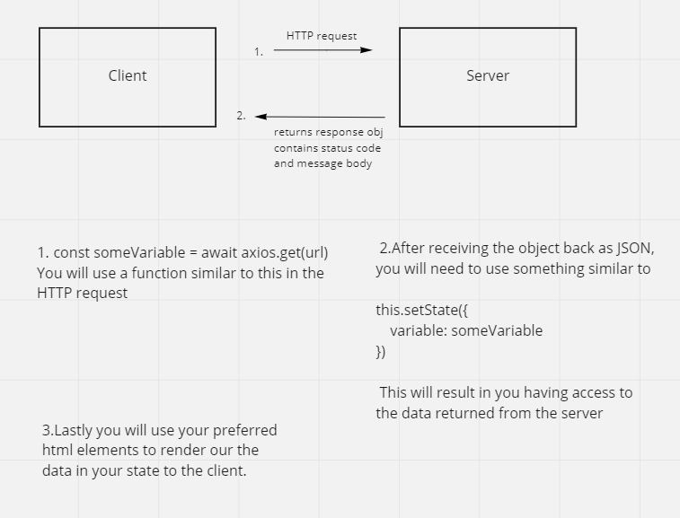
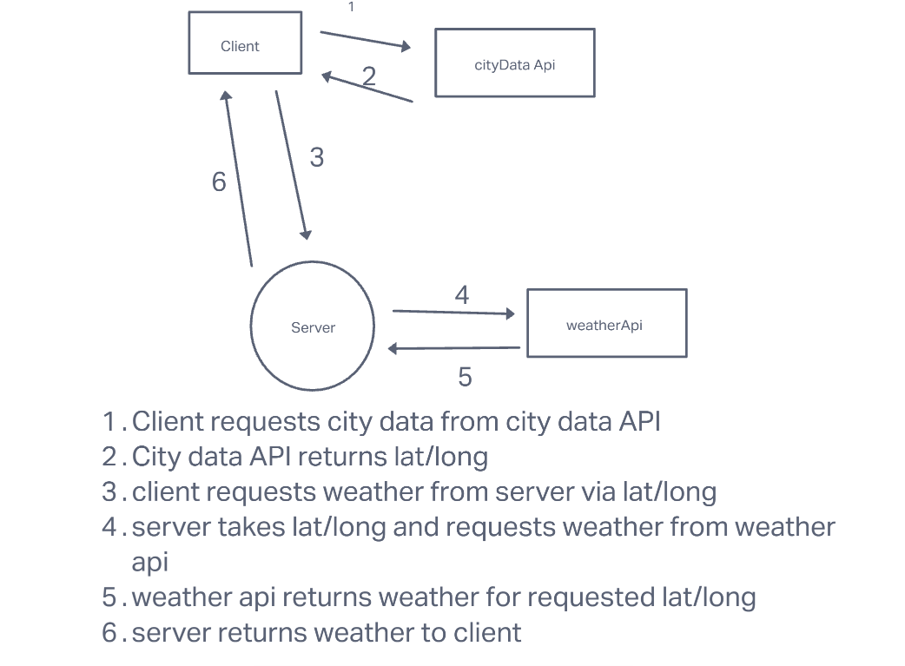
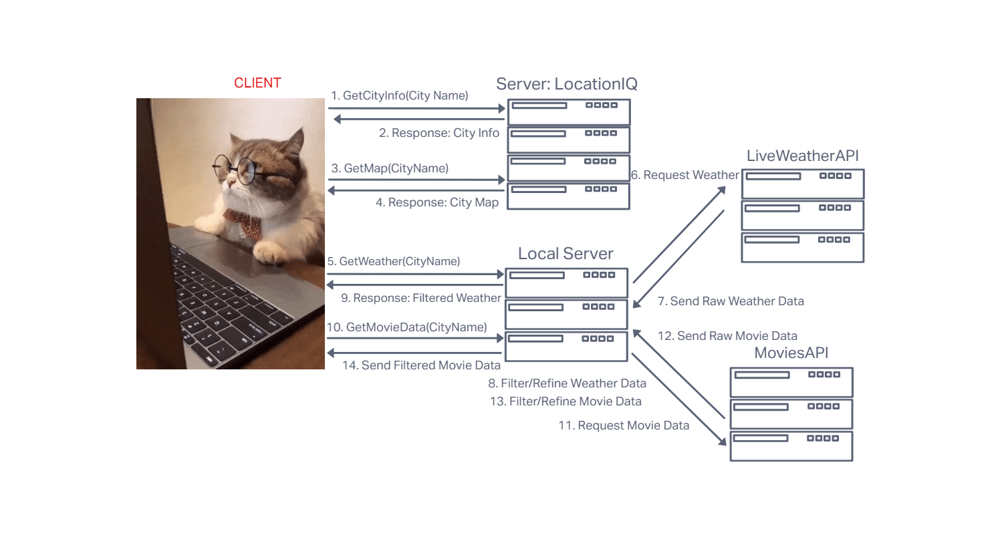

# city-explorer-api

**Author**: Brady Davenport

**Version**: 1.0.0

## Overview
<!-- Provide a high level overview of what this application is and why you are building it, beyond the fact that it's an assignment for this class. (i.e. What's your problem domain?) -->

## Getting Started
<!-- What are the steps that a user must take in order to build this app on their own machine and get it running? -->

* Create a new repo on GitHub and clone it to local

* Run `npm init` to create a new project
  * review and edit `package.json` if desired

* Use `npm install` to add `express`, `dotenv`, and `cors` dependencies

* add a `.gitignore` and `.eslintrc.json`

* Copy contents of `weather.json` and add to empty local `data/weather.json`

* Set contents of .env to have a value for `PORT` and make sure `.env` is in `.gitignore`

* Populate `README.md`

## Architecture
<!-- Provide a detailed description of the application design. What technologies (languages, libraries, etc) you're using, and any other relevant design information. -->

## Change Log
<!-- Use this area to document the iterative changes made to your application as each feature is successfully implemented. Use time stamps. Here's an example:

01-01-2001 4:59pm - Application now has a fully-functional express server, with a GET route for the location resource. -->

### Lab 06

### Lab 07

#### 17 May 2022

##### Name of feature: Setup

Estimate of time needed to complete: 30mins

Start time: 5:00

Finish time: 5:27

Actual time needed to complete: 27 mins

##### Name of feature: Weather

Estimate of time needed to complete: 2 hours

Start time: 6:55

Finish time: 9:30

Actual time needed to complete: 2hrs 35mins

#### 18 May 2022

##### Name of feature: Errors

Estimate of time needed to complete: 30 mins

Start time: 5:00

Finish time:  5:20

Actual time needed to complete: 20 mins

### Lab 08

#### Name of feature: Weather (live)

Estimate of time needed to complete: 2 hrs

Start time: 5:37

Finish time: 8:45

Actual time needed to complete: 2 hrs 8 mins

#### 19 May 2022

Name of feature: Movies

Estimate of time needed to complete: 1 hr

Start time: 1:30

Finish time: 3:00

Actual time needed to complete: 1.5 hours

## Credit and Collaborations

Lab 06 Web Request Response Cycle - Collaborated with [Cody Davis](https://github.com/Cozhee/)

Lab 07 Web Request Response Cycle - Collaborated with [Dylan Ullrich](https://github.com/GetUllrichorDieTrying)

Lab 08 Web Request Response Cycle - Collaborated with [Benjamin Small](https://github.com/BenjaminSmall94)

Lab 09 Web Request Response Cycle - Collaborated with [Sam Brindle](https://github.com/samBrindle)

Lab 10 Web Request Response Cycle - Collaborated with [Stanley Wilder](https://github.com/stanwilder)
